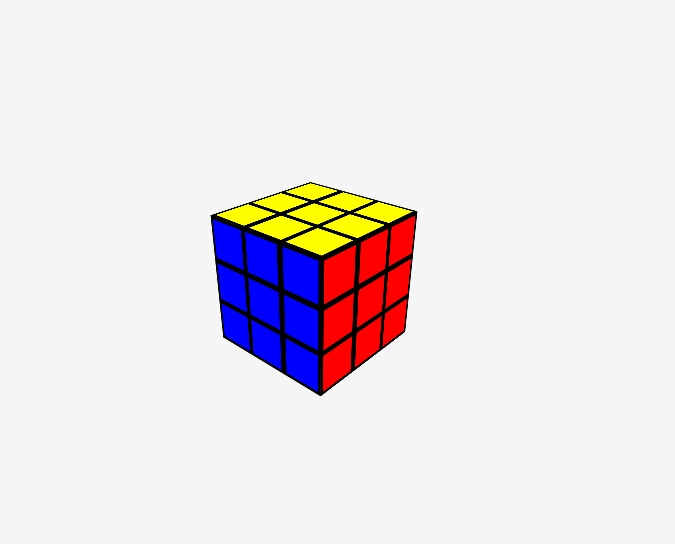
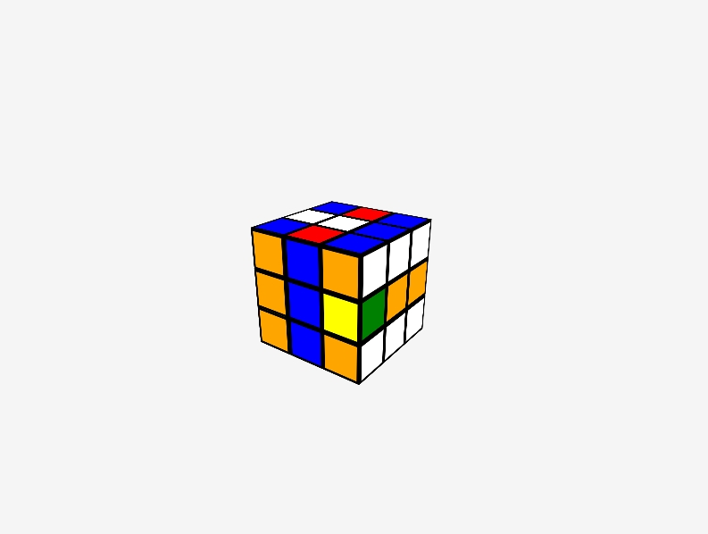
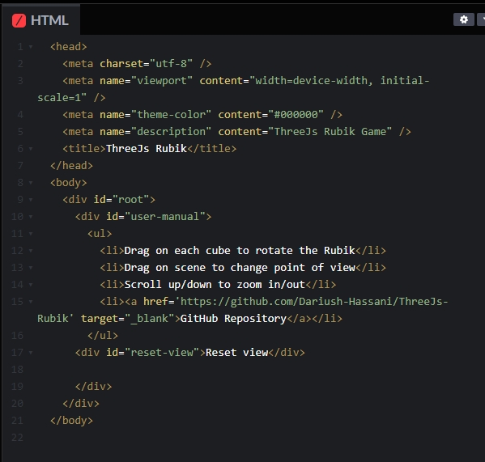
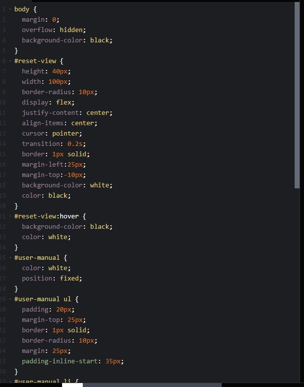
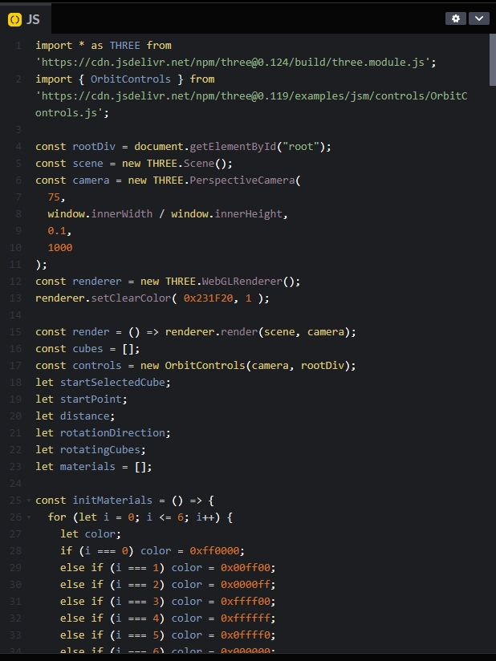

# jsha0625_9103_quiz8

# Here is the reference image of inspiration of what I found **(Part1)**
# Links
[Interactive Rubik's Cube](https://cube-j4t2.onrender.com/?cst=87127)

It's a Rubik's Cube that can be interacted with, I think it's cool to create in 3D through a webpage, the assignment we get are all flat drawings created in 2D, and I want to be able to bring it to life in 3D to give the painting the feeling of coming to life, the feeling of someone being able to touch it easily. People allowed to play with rotating spinning kinds of all functinos.
# **Screen Shot**

# Here is how it gonna be fullfilled **(Part2)**

# Links
[Assistant Code](https://codepen.io/Dariushhassani/pen/vYWZmpg)

This code breaks the limitations of the 2D plane in the Web rendering, through the coordinate positioning to draw a whole 3D space, and so that the Rubik's Cube can be controlled by the mouse to rotate, I think not only HTML, CSS, or JS, the contents of which are worthy of drawing on the part of the function and construction.
# **Screen Shot**

